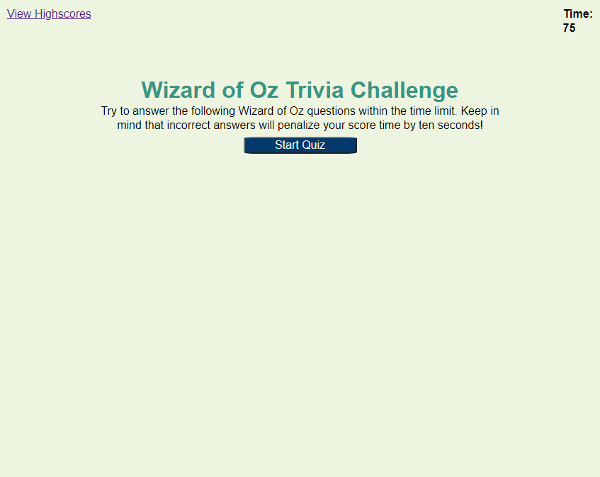
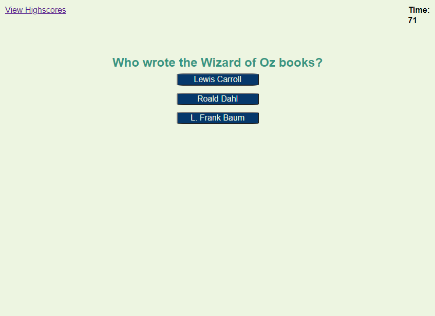

# Quiz Game

## Table of Contents
* [Description](#description)
* [Links](#links)
* [Scoring](#scoring)
* [Screenshots](#screenshots)
* [License](#license)

## Description
This is a quiz game with questions about The Wizard of Oz. There is a timer of 75 seconds. When the game starts, the timer starts counting down and multiple choice questions are presented to the user. The game ends when the timer has reached 0 or when all questions have been answered. At game end, the user is presented with their score and an input box to enter their initials. The user can choose to save their initials and then the initials and score will be displayed on the high score page. Users can clear the initials and scores.

## Links
* [Quiz Game Website](https://seattlesal.github.io/code-quiz/)
* [High Scores Website](https://seattlesal.github.io/code-quiz/high-scores.html)
* [GitHub Repository](https://github.com/SeattleSal/code-quiz)

## Scoring
The user will gain points for every correct answer they provide. The user will lose 10 seconds time on the timer for incorrect answers.

Local storage is used to allow the user to store multiple initials and scores. The user can also clear all scores stored.

## Screenshots
Game start page:

Example question:

High Score page:

## License
Copyright 2020 Sally Perez

Permission is hereby granted, free of charge, to any person obtaining a copy of this software and associated documentation files (the "Software"), to deal in the Software without restriction, including without limitation the rights to use, copy, modify, merge, publish, distribute, sublicense, and/or sell copies of the Software, and to permit persons to whom the Software is furnished to do so, subject to the following conditions:

The above copyright notice and this permission notice shall be included in all copies or substantial portions of the Software.

THE SOFTWARE IS PROVIDED "AS IS", WITHOUT WARRANTY OF ANY KIND, EXPRESS OR IMPLIED, INCLUDING BUT NOT LIMITED TO THE WARRANTIES OF MERCHANTABILITY, FITNESS FOR A PARTICULAR PURPOSE AND NONINFRINGEMENT. IN NO EVENT SHALL THE AUTHORS OR COPYRIGHT HOLDERS BE LIABLE FOR ANY CLAIM, DAMAGES OR OTHER LIABILITY, WHETHER IN AN ACTION OF CONTRACT, TORT OR OTHERWISE, ARISING FROM, OUT OF OR IN CONNECTION WITH THE SOFTWARE OR THE USE OR OTHER DEALINGS IN THE SOFTWARE.

